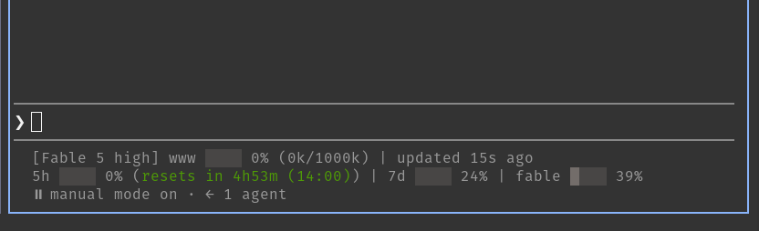

# claude-code-statusline

Statusline for [Claude Code](https://claude.com/claude-code): context-window bar, 5h/7d/weekly rate-limit bars, staleness age.



Requires [`jq`](https://jqlang.org/) — Claude Code feeds the statusline script a JSON blob on stdin (model, context window, rate limits, etc.), and the script uses `jq` to pull fields out of it. Install via your package manager, e.g. `apt install jq` / `brew install jq`.

## Install

```sh
curl -fsSL https://raw.githubusercontent.com/stelsoft/claude-code-statusline/main/statusline.sh -o ~/.claude/statusline.sh
chmod +x ~/.claude/statusline.sh
```

Add to `~/.claude/settings.json`:

```json
{
  "statusLine": {
    "type": "command",
    "command": "~/.claude/statusline.sh"
  }
}
```
