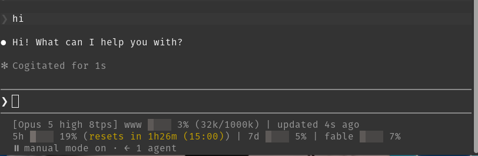

# claude-code-statusline

A statusline for [Claude Code](https://claude.com/claude-code).

- Context-window bar with token count
- 5h / 7d rate-limit bars with reset countdown, straight from Claude Code's own
  rate-limit data — same numbers `/usage` shows. The countdown shows on the first
  frame of a new session, before that data arrives, by reusing the last known
  reset time
- Fable weekly bar, scraped from `/usage` in the background (nothing else carries
  it); hidden when that snapshot reports 0
- Average output speed in tokens/sec, next to the model name — session output
  tokens over the time the API spent generating them; blank until the first API
  call finishes
- `updated Xs ago` — when the 5h figure last actually moved
- Runs on Linux, macOS, and Windows (Git Bash or WSL) — just `bash`



## Requirements

Nothing to install — `bash` plus tools that already ship with the OS. UTF-8
terminal for the `▓▒░` bars.

- **Windows** — Git Bash or WSL. Not `cmd.exe` or PowerShell.
- **macOS** — reset countdown stays blank for a new session's first frames; BSD
  `date` can't parse the text form.

## Install

```sh
curl -fsSL https://raw.githubusercontent.com/stelsoft/claude-code-statusline/main/statusline.sh -o ~/.claude/statusline.sh
chmod +x ~/.claude/statusline.sh
```

Then add to `~/.claude/settings.json`:

```json
{
  "statusLine": {
    "type": "command",
    "command": "~/.claude/statusline.sh"
  }
}
```
